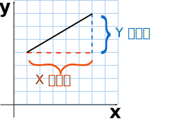
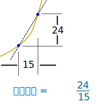
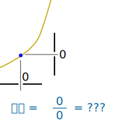
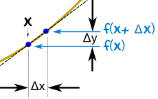
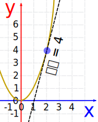

# 函数求导
</br>
**图片来自电影《这个杀手不太冷》** </br>
这部电影是影迷的入门，求导也是机器学习的入门。</br>

## 作者往事回忆:
如果我没记错的话，导数应该是大一高等数学的课程，怎么会记错呢？！</br>
上微积分那堂课那天凌晨我去医院缝针去了....</br>
大概凌晨3,4点钟吧，睡觉前喝了一大桶水，所以不得不在这个点儿起来上厕所。</br>
宿舍楼道里的厕所位置太熟悉了，我闭着眼睛就能过去，太困了，一边走一边睡吧。</br>
嗯，应该是这，“哐嘡~~~~~~”，啊，我睁开眼，这是厕所隔壁宿舍！？，我说呢，厕所应该是没有门的。</br>
有个同学惊醒了，从床上坐了起来，我连忙说走错了，不好意思啊，关上了门快速的进了隔壁的厕所。</br>
一边上厕所，一边觉得眼睛上边有点痒痒，我用手一碰，我的天哪，满手是血！！，这才意识到自己被门上的钉子撞出一个口子。</br>
我跑回了宿舍，叫醒了同宿舍的邓亚光，为什么叫他，我也不知道，可能是只有他手头有点钱吧。</br>
你咋了这是，我说我被撞了，来不及解释了，我现在咋办？邓亚光在月光中看着我想了好半天跟我说，你这个得缝针，我给你点钱你得去缝针去，我拿着钱马上往外走，亚光兄说用我陪你去吗？我很自信的说了句不用，就冲出去了。</br>
校园里夜深人静，从这里走出去能见到马路打上车得走10多分钟，我是不顾那么多了，能打到车就算是有救了。</br>
十分钟后，我看到了马路，感觉我脸上的血已经被夜风吹干了，那个年代是2002年左右，当时是没有滴滴出行之类的app的，只能等着，等着，再等着。</br>
又是10几分钟过去了，来了一辆车，我马上挥手，冲他喊叫“我要去医院缝针，要去缝针！！”。</br>
司机开近了看到了我踩了脚油门又走了。</br>
我觉得应该是被我吓到了，凌晨3，4点钟，一个满脸是血的人在马路上</br>
我又等了不知多长时间，又有一辆出租车开过来了，这回我尽量不叫唤，等他开过来再说，司机看了看我，知道我需要缝针后，同意让我上车了。</br>
司机说：“这个时间不好找医院缝针，我给你想想啊，是不是妇产医院可以缝针呀，他们能给刨妇产缝针，也能给你缝针呀，而且生孩子是不分时候的。”</br>
我对这个老司机的分析惊呆了，说的真有道理，于是我们去了北京妇幼保健医院，一个粉红色的大楼。</br>
我下了车，把钱给了司机，跑到了接待处，对着值班的人说我要缝针，她看我满脸是血，说：“我们只给孕妇缝针，不给其他人缝的”</br>
我只能又跑回了马路，那个司机已然远去了。。。。</br>
又过了不知多久，我又打了一辆车，天色已经有点亮了，这回司机把我送到了某某某医院。</br>
我到了某某某医院，办完了手续进了手术室，护士告诉我缝针的医生还在睡觉，让我等她醒了才能缝针，我只能等着，我就在床上躺着，不知多久，外面树上的鸟开始叫了起来，太阳已经出来了。</br>
这时一个医生进来了，在脸盆里洗了好长时间的脸，换上工作服之后，她终于给我缝针了！！！一缕缕阳光穿过纱布照到我的脸上，好像上帝之光一样。</br>
逢完针后，我父母也赶到了医院把我接回了学校，吃了早饭，觉得呆着也没啥事，我就去上课了。</br>
这节课讲的就是函数求导，同学们看着我脸上的包扎，我看着黑板，麻药劲儿过去了，隐隐的阵痛，我的脑子也是空空的，不知道在想些什么。。。</br>

来，事情已经过去很久了，让我们重新复习一下导数的内容吧。</br>

## 导数入门
导数其实全是与坡度有关的！</br>
坡度 = y的改变 / x的改变</br>
</br>
我们可以求两点之间的 **平均** 坡度</br>
</br>
但我们怎样求在一点的坡度？</br>
没有什么可以测量的！</br>
</br>
但是，在导数里，我们可以用一个很小的差……</br>
……然后把它**缩小到零**。</br>
坡度 = delta y / delta x</br>
**咱们来求个导数吧**！</br>
求函数 y = f(x) 的导数，我们用坡度的公式：</br>
坡度 = Y的改变 / X的改变 = Δy / Δx </br>
我们看到（如图）:</br>
x 从 	  	x 	变到 	x+Δx</br>
y 从 	  	f(x) 	变到 	f(x+Δx)</br>
</br>
按照这步骤去做：</br>
    代入这个坡度公式： Δy / Δx = f(x+Δx) − f(x) / Δx
    尽量简化
    把 Δx 缩小到零。
像这样：</br>
举个例子：函数 f(x) = x²</br>
我们知道 f(x) = x²，也可以计算 f(x+Δx) ：</br>
开始：f(x+Δx) = (x+Δx)²</br>
(x + Δx)²:f(x+Δx) = x² + 2x Δx + (Δx)²</br>
坡度公式是： 	(f(x+Δx) − f(x)) / Δx </br>
代入 f(x+Δx) 和 f(x)： 	(x² + 2x Δx + (Δx)² − x²) / Δx </br>
简化 (x2 and −x2 约去）： 	(2x Δx + (Δx)²) / Δx </br>
再简化（除以 Δx）： 	  = 2x + Δx</br>
当 Δx 趋近 0时，我们得到： 	= 2x</br>
结果：x² 的导数是 2x</br>
我们写 dx，而不写 "Δx 趋近 0"，所以 "的导数" 通常是写成 d/dx</br>
d/dx * x² = 2x</br>
"x² 的导数等于 2x"</br>
或 "x² 的 d dx 等于 2x"</br>
d/dx * x2 = 2x 的意思是什么？</br>
意思是，对于函数 x²，在任何一点的坡度或 "变化率" 是 2x。</br>
所以当 x=2，坡度是 2x = 4，如图所示：</br>
或当 x=5，坡度是 2x = 10，以此类推。</br>
</br>
注意：f’(x) 也是 "的导数" 的另一个写法：</br>
f’(x) = 2x</br>
"f(x) 的导数等于 2x"</br>
**希望读者可以在纸上推到全过程。**</br>
在线求导工具:</br>
http://www.nicetool.net/app/derivative.html </br>
输入(x+5)² 后得出倒数就是2 * (x+5)</br>
https://www.derivative-calculator.net/</br>

## python实现函数求导
<a href="derivativeToGif.py">derivativeToGif.py</a>中有完整的实现和代码注释</br>
修改custFunction里的函数可以在自定义函数中求导</br>
```py
def custFunction(x):
    return np.sin(x)
    # return 3*x*x+2*x+1
    #  return x*x
```
效果如下:</br>


参考: https://www.shuxuele.com/calculus/derivatives-introduction.html</br>