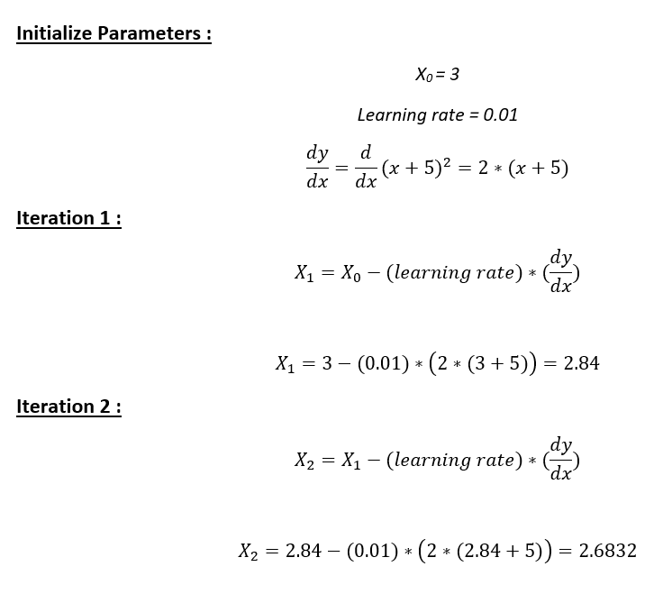
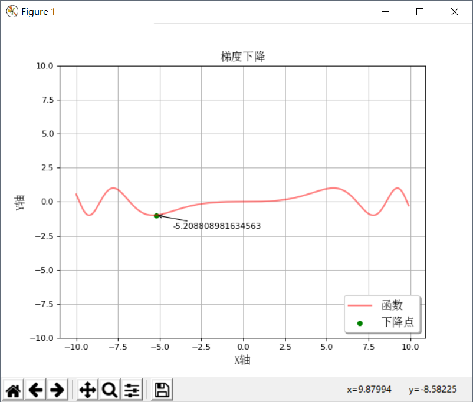

# 梯度下降
</br>
**图片来自电影《天堂电影院》** </br>
一部老电影。。。</br>

## 什么是梯度下降？</br>
它是一种查找函数最小值的优化算法。 我们从函数的随机点开始，并在函数的梯度的负方向上移动以达到局部/全局最小值。</br>
</br>
举个例子：</br>
问题：从点x = 3开始，找出函数y =（x + 5）²的局部最小值</br>
</br>
解决方案：我们只需查看图表即可知道答案。 </br>
当x = -5时，y =（x + 5）²达到它的最小值（即当x = -5，y = 0时）。 因此，x = -5是函数的局部和全局最小值。</br>
现在，让我们看看如何使用梯度下降方式获得相同的数字。</br>

**第1步:** 初始化x = 3。 然后，找到函数的梯度，dy / dx = 2 *（x + 5）。</br>
**第2步:** 向渐变的负方向移动（为什么？）。 </br>
但等等，要移动多少？ </br>
为此，我们需要学习率。让我们假设学习率→0.01</br>
**第3步:** 让我们执行2次梯度下降迭代</br>
</br>


**步骤4:** 我们可以观察到X值正在缓慢下降并且应该收敛到-5（局部最小值）。 但是，我们应该执行多少次迭代？</br>

让我们在算法中设置一个精度变量，计算两个连续“x”值之间的差值。 如果连续2次迭代的x值之间的差异小于我们设置的精度，请停止算法！</br>

## Python中的梯度下降：
第1步：初始化参数</br>
```py
cur_x = 3 # 初始值x设置为3
rate = 0.01 # 学习率
precision = 0.000001 #当学习进步幅度小于此值时退出学习算法
previous_step_size = 1 # 上一次学习的进步值
max_iters = 10000 # 最大迭代次数
iters = 0 #当前迭代数
df = lambda x: 2*(x+5) #此方程的倒数
```
第2步：运行循环以执行梯度下降：</br>
注意:当来自2次连续迭代的x值之间的差异小于0.000001或者当迭代次数超过10,000时，停止循环</br>
```py
while previous_step_size > precision and iters < max_iters:
    prev_x = cur_x #更新上一次的值
    cur_x = cur_x - rate * df(prev_x) #梯度下降跟新值
    previous_step_size = abs(cur_x - prev_x) #算出学习进步值
    iters = iters+1 #更新迭代次数
    print("Iteration",iters,"\nX value is",cur_x) #打印值
print("The local minimum occurs at", cur_x)
```
输出：从下面的输出中，我们可以观察前10次迭代的x值 - 可以通过上面的计算进行交叉检查。 该算法在终止之前运行595次迭代。</br>
</br>
<a href="GDToGif.py">GDToGif.py</a>中有完整的实现和代码注释</br>
修改custFunction里的函数可以在自定义函数梯度下降</br>
```py
def custFunction(x):
    return np.sin(x)
    # return np.sin(0.01*x**3)
    # return x*x
```
效果如下:</br>
</br>
</br>
可以试试这个函数：sin(0.01*x^3)，初始值同样是3，最后下降到了-5.2最低点</br>
    return np.sin(0.01*x**3)</br>
</br>
在线画函数工具：</br>
https://www.desmos.com/calculator</br>

参考：https://towardsdatascience.com/implement-gradient-descent-in-python-9b93ed7108d1</br>