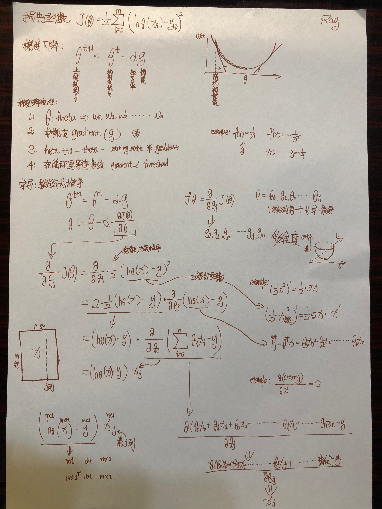
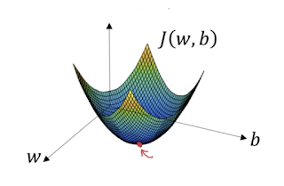
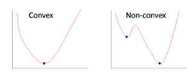
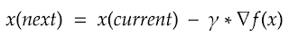
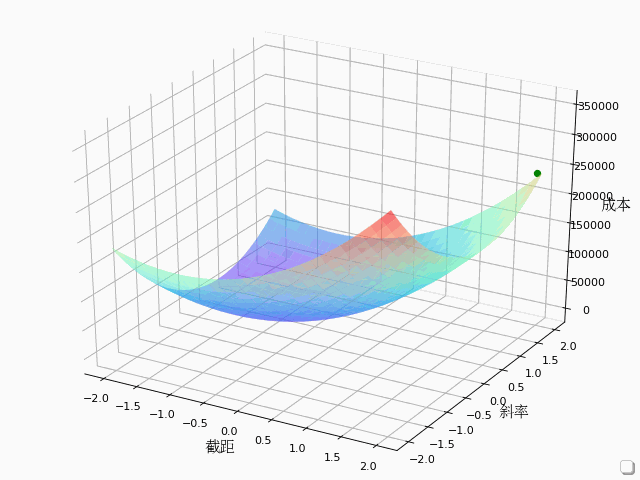
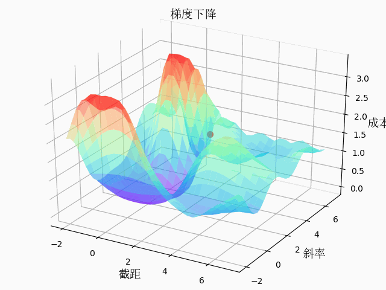
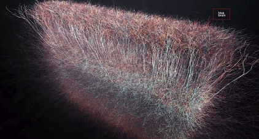

# 梯度下降在回归中的数学推导
 
**图片来自电影《知无涯者》**  
一个接近神的印度数学家 拉姆奴金，擅长无极限问题。在不平等的时代中，从一个默默无闻的贫苦印度少年，离开家乡独自前往英国剑桥求学，在战争的动荡、备受歧视的年代中，受到英国著名数学教授哈代的赏识，两人亦师亦友地互相扶持下，在数学领域上成功挖掘出更美好的成果。 

# 数学推导过程

梯度下降的过程为：这一时刻的权重=上一时刻的权重-学习率*梯度 
权重：在数学公式中写成theta, 或者w, 一般权重不止一个，所以泛指为许多权重，比如:w0,w1,w2........wn 

学习率：每次改变的幅度，幅度小了精度高，学习速度慢，幅度大了最初学习速度快，精度低，容易震荡，要调整为合适的度。 

梯度：就是损失函数的梯度，函数的导数，也是下边要着重解释推导的内容。 

核心问题是如何求梯度(g)，

 

关于图中的推导过程需要一些导数的基础知识，下面来快速复习以下： 

      1：首先我们如果想知道一个函数在某一点的导数，只需要求出这个函数的导函数在把x带进去求出的y就是这一点的导数，比如：
      f(x)=-1/x 那么 f(x)的导数就等于-1/x^2
      如果计算x=2时刻的x的梯度，就直接把x=2带入-1/x^2中就算出-1/4，也就是-1/x这个函数在x=2时刻的梯度就是-1/4了

      2: 1/2*(x^2)的导数是 1/2*2*x=x 一个数的n次方的导数就是n*这个数，这也是为什么推导过程中会无缘无故加一个1/2常数，其实是方便推到，和求导时生成的2抵消变成1。

      3：同样用2中的例子，如果1/2*(x^2)中的x是一个复合函数的话，那么等式就变成了1/2*x再*x的导数 也就是复合函数要继续求导。

      4:如果我们对2*x+y 求导，会得到2，也就是说y我们不需要考虑进去，同样2*x0+y0,2*x1+y1.....2*xj+yj+...2*xn+yn这个函数，我们只针对xj求导的话，还是等于2，也就是说x0,x1....xn和y0,y1.....yn我们不需要考虑进去的。

知道以上4点导数推导的性质，举一反三用这些思想带入到上图中的推导过程中就容易明白了 
我们可以认为theta(w0,w1....wn)是有这么多组合的旋钮。我们就不能用暴力吗？不，那是非常低效的。所以我们用梯度下降优化的方法来实现这一点。 
梯度下降背后的直觉是，我们朝着m和b对成本函数的偏导数最陡的方向移动。 
 
成本函数可能不是非凸的。在这种情况下，我们可能以局部极小值而不是全局极小值结束。但是在线性回归的情况下，成本函数总是一个凸函数。 
 
Convex Vs. Non-convex
我们如何更新权重（M和B）？使用这个方程 
 
但是我们如何找到这些系数呢？这就是学习过程。我们可以用不同的方法找到这些。一种是普通最小二乘法，另一种是梯度下降法。 
想象一个山谷和一个没有方向感的人想要到达山谷的底部。他走下斜坡，当斜坡很陡时，他会走大步；当斜坡不那么陡时，他会走小步。他根据当前的位置决定下一个位置，到达谷底时停下来，这就是他的目标。 
<a href="LRToGif3D.py">LRToGif3D.py</a>中实现了两个权重针对损失函数构建的3D梯度下降过程和代码注释，用于直线拟合问题y=a * x + b 
 
<a href="LR2GifTF.py">LR2GifTF.py</a>中用tensorflow实现了两个权重针对损失函数构建的3D梯度下降过程和代码注释，函数为y=sin(b * cos(a * x)) 
 
可以看到直线拟合问题对于机器学习来说就是在一个碗里下降，然而一些复杂一些的比如带有sin的函数就像是在连绵起伏的山谷里下山 
同样在之后的神经网络训练中地形要比这个复杂的多，而且不仅是2个参数，2个参数可以构建一个3D图人类可以看明白，超过3维的图就很难描述了，人类理解抽象起来也不容易了。 

<!-- 视频推导： 
https://edu.51cto.com/center/course/lesson/index?id=280686 -->

<!-- 线性回归梯度下降推导
推导线性回归损失函数导函数_以及代码实现批量梯度下降 -->

