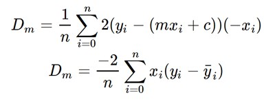
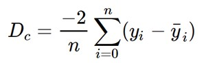
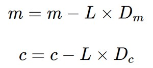

编程

在这里，我将使用Python来编码线性回归模型。 我使用Python是因为它是我进行数据科学的首选语言。 此外，Python对于专家和初学者都很有用。 该语言是为了便于阅读而制作的，因此无论您是编程多年还是编程一天，通过读懂其他人的代码仍然相当容易。

```py
def linear_regression(X, y, m_current=0, b_current=0, epochs=1000, learning_rate=0.0001):
     N = float(len(y))
     for i in range(epochs):
          y_current = (m_current * X) + b_current
          cost = sum([data**2 for data in (y-y_current)]) / N
          m_gradient = -(2/N) * sum(X * (y - y_current))
          b_gradient = -(2/N) * sum(y - y_current)
          m_current = m_current - (learning_rate * m_gradient)
          b_current = b_current - (learning_rate * b_gradient)
     return m_current, b_current, cost
```

为了更简单地理解，让我们举个例子假设你在山顶，你必须到达一个位于山峰最低点的湖泊。 然而，你被蒙上眼睛，你看不到自己的目标。 那么，你将采取什么方法到达湖泊？

最好的方法是检查你附近的地面，并观察土地往往下降的地方。 这将为您迈出第一步的方向提供一个想法。 如果沿着下行路径前行，很可能会到达湖泊。

解决这类问题的一种标准方法是通过结合我们可以实现的梯度下降函数来定义误差函数（也称为成本函数），该函数测量给定线的拟合程度。该函数将采用（m，b） ）配对并根据线条适合我们数据的程度返回错误值。 为了计算给定线的这个误差，我们将遍历数据集中的每个（x，y）点，并求和每个点的y值和候选线的y值（在mx + b处计算）之间的平方距离。 通常将这个距离平方以确保它是正的并使我们的误差函数可微分。

</br>

```py
# y = mx + b 
# m is slope, b is y-intercept 
def computeErrorForLineGivenPoints(b, m, points): 
totalError = 0 for i in range(0, len(points)): 
   totalError += (points[i].y — (m * points[i].x + b)) ** 2 
return totalError / float(len(points))
```

为了对这个损失函数进行梯度下降，我们首先需要计算它的梯度。坡度就像一个指南针，总是指引我们下坡。为了计算它，我们需要微分我们的损失函数。因为我们的函数是由两个参数（m和b）定义的，所以我们需要为每个参数计算偏导数。这些导数是：

记住这个平方误差方程偏导数之和

</br>

```py
def stepGradient(b_current, m_current, points, learningRate):
   b_gradient = 0 
   m_gradient = 0 
   N = float(len(points)) 
for i in range(0, len(points)): 
   b_gradient += -(2/N) * (points[i].y — ((m_current*points[i].x) +  b_current)) 
   m_gradient += -(2/N) * points[i].x * (points[i].y — ((m_current * points[i].x) + b_current)) 

new_b = b_current — (learningRate * b_gradient) 
new_m = m_current — (learningRate * m_gradient) 
return [new_b, new_m]
```

我们可以认为m和b是有这么多组合的旋钮。我们就不能用暴力吗？不，那是非常低效的。我们可以通过一种称为梯度下降优化的方法来实现这一点。

梯度下降背后的直觉是，我们朝着m和b对成本函数的偏导数最陡的方向移动。

</br>

成本函数可能不是非凸的。在这种情况下，我们可能以局部极小值而不是全局极小值结束。但是在线性回归的情况下，成本函数总是一个凸函数。

</br>
Convex Vs. Non-convex

我们如何更新权重（M和B）？使用这个方程

</br>

但是我们如何找到这些系数呢？这就是学习过程。我们可以用不同的方法找到这些。一种是普通最小二乘法，另一种是梯度下降法。

想象一个山谷和一个没有方向感的人想要到达山谷的底部。他走下斜坡，当斜坡很陡时，他会走大步；当斜坡不那么陡时，他会走小步。他根据当前的位置决定下一个位置，到达谷底时停下来，这就是他的目标。

让我们尝试将梯度下降应用于m和c，并逐步接近它：

1：最初，m=0，c=0。L是学习率。这将控制m值随每个步骤的变化量。L可以是一个很小的值，比如0.0001，以获得良好的精度。

2：计算损失函数相对于m的偏导数，并将x、y、m和c的当前值代入其中，得到导数值d。

</br>
m的导数方程

</br>
c的导数方程

3：现在，我们使用以下公式更新m和c的当前值：
</br>

视频推导：</br>
https://edu.51cto.com/center/course/lesson/index?id=280686

线性回归梯度下降推导

推导线性回归损失函数导函数_以及代码实现批量梯度下降

