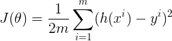
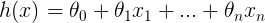
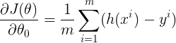
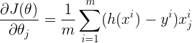
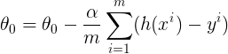
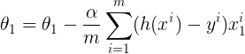
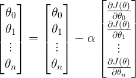
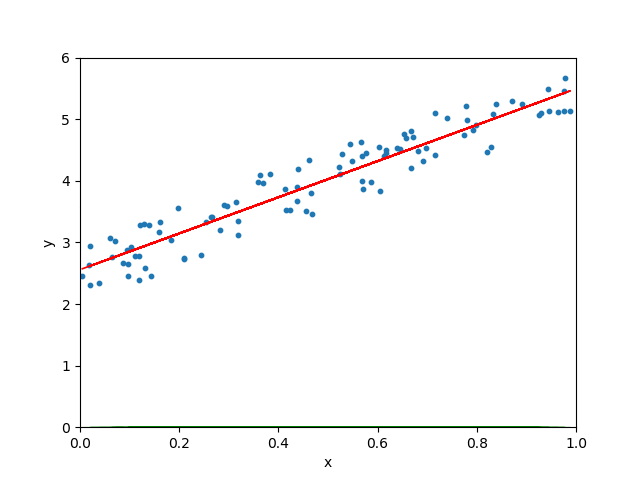
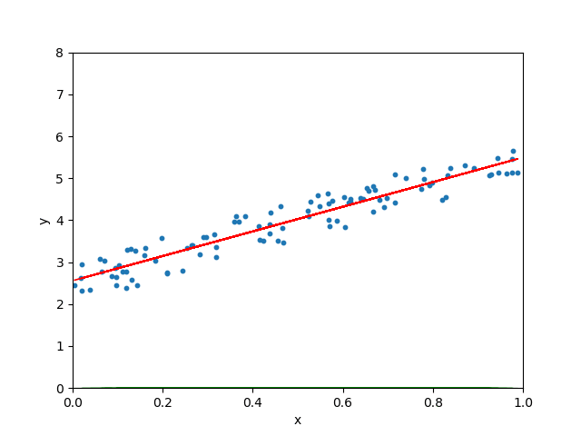

# ML
机器学习

https://towardsdatascience.com/linear-regression-using-python-b136c91bf0a2

**用python徒手写线性回归：**</br>
线性回归通常是每个数据科学家遇到的第一个机器学习算法。</br>
这是一个简单的模型，但每个人都需要掌握它，因为它为其他机器学习算法奠定了基础。</br>
**哪里可以使用线性回归?**</br>
这是一项非常强大的技术，可用于了解影响盈利能力的因素。</br>
通过分析前几个月的销售数据，它可用于预测未来几个月的销售额。</br>
它还可用于获取有关客户行为的各种见解。</br>
在博客结束时，我们将构建一个如下图所示的模型，即确定最适合数据的行。</br>
</br>
这是我要介绍的机器学习系列的第一篇博客。</br>
人们可能会被网络上关于机器学习算法的文章数量所淹没。</br>
我撰写此博客的目的有两个方面。</br>
它可以作为进入机器学习领域的人的指南，它可以作为我的参考。</br>

目录

     什么是线性回归
     线性回归假说
     训练线性回归模型
     评估模型
     scikit-learn实现


什么是线性回归

线性回归模型的目标是找到一个或多个特征（自变量）和连续目标变量（因变量）之间的关系。 当只有一个特征时，它被称为单变量线性回归，如果有多个特征，则称为多元线性回归。

线性回归假说

线性回归模型可以由以下等式表示

</br>
y=b0+b1*x1+b2*x2+ ...... +bn*xn</br>
```py
y_pred = np.dot(x, self.w_)
```

Y是预测值

     θ0是偏差项。
     θ1，...，θₙ是模型参数
     x1，x2，...，xₙ是特征值。

上述假设也可以用</br>
</br>

其中

     θ是模型的参数向量，包括偏置项θ0
     x是x0 = 1的特征向量

数据集

让我们创建一些随机数据集来训练我们的模型。

```py
# imports
import numpy as np
import matplotlib.pyplot as plt

# generate random data-set
np.random.seed(0)
x = np.random.rand(100, 1)
y = 2 + 3 * x + np.random.rand(100, 1)

# plot
plt.scatter(x,y,s=10)
plt.xlabel('x')
plt.ylabel('y')
plt.show()
```

使用上面代码生成的数据集的图如下所示：</br>
</br>

训练线性回归模型

训练模型意味着找到参数，以便能用最合适的方式拟合数据。

如何确定最合适的拟合线?</br>
这条线在哪?</br>
预测值与观测值之间的误差最小称为最佳拟合线或回归线。</br>
这些错误也称为残差。</br>
可以通过从观察数据值到回归线的垂直线来可视化残差。</br>
</br>


为了定义和测量模型的误差，我们将成本函数定义为残差平方和。</br>
成本函数表示为:</br>
</br>
```py
1/2m((b0*x0-y0)**2 + (b1*x1-y1)**2 + (b2*x2-y2)**2 + ...... + (bm*xm-ym)**2)

y_pred = np.dot(x, self.w_)
residuals = y_pred - y
cost = np.sum((residuals ** 2)) / (2 * m)

```
其中假设函数h(x)表示为</br>
</br>
m是我们数据集中的训练样例总数。</br>

为什么我们取残差的平方而不是残差的绝对值?</br>
我们想把那些离回归线远的点惩罚更重一点。</br>

我们的目标是找到模型参数, 使成本函数最小化。</br>
我们将使用 **Gradient Descent(梯度下降)** 来找到它。</br>

梯度下降

梯度下降是许多机器学习算法中使用的通用优化算法。</br>
它迭代地调整模型的参数，以最小化成本函数。</br>
梯度下降的步骤概述如下。</br>

     我们首先使用一些随机值初始化模型参数。 这也称为随机初始化。
     现在我们需要测量成本函数如何随着参数的变化而变化。 因此，我们将成本函数w.r.t的偏导数计算为参数θ0，θ1，...，θₙ

</br>
</br>
类似地，成本函数w.r.t对任何参数的偏导数可以表示为</br>

</br>

我们可以一次计算所有参数的偏导数</br>
其中h(x)是</br>
</br>

     计算导数后，我们更新下面给出的参数

</br>
</br>

其中α是学习参数。</br>
我们可以一次性更新所有参数</br>
</br>

```py
y_pred = np.dot(x, self.w_)
residuals = y_pred - y
gradient_vector = np.dot(x.T, residuals)
self.w_ -= (self.eta / m) * gradient_vector
```

我们重复步骤2,3，直到成本函数收敛到最小值。</br>
如果α的值太小，则成本函数需要更长的时间来收敛。</br>
如果α太大，则梯度下降可能超过最小值并且最终可能无法收敛。</br>
</br>

为了演示梯度下降算法，我们用0初始化模型参数。</br>
方程变为Y = 0.梯度下降算法现在尝试更新参数的值，以便我们到达最佳拟合线。</br>
当学习速度非常慢时，梯度下降需要更长的时间来找到最佳拟合线。</br>
</br>
当学习率一般时</br>
</br>
当学习速率任意高时，梯度下降算法保持超调最佳拟合线，甚至可能无法找到最佳线。</br>
</br>


从头开始实现线性回归

下面给出了具有梯度下降的线性回归的完整实现。</br>

```py

# imports
import numpy as np


class LinearRegressionUsingGD:
    """Linear Regression Using Gradient Descent.
    Parameters
    ----------
    eta : float
        Learning rate
    n_iterations : int
        No of passes over the training set
    Attributes
    ----------
    w_ : weights/ after fitting the model
    cost_ : total error of the model after each iteration
    """

    def __init__(self, eta=0.05, n_iterations=1000):
        self.eta = eta
        self.n_iterations = n_iterations

    def fit(self, x, y):
        """Fit the training data
        Parameters
        ----------
        x : array-like, shape = [n_samples, n_features]
            Training samples
        y : array-like, shape = [n_samples, n_target_values]
            Target values
        Returns
        -------
        self : object
        """

        self.cost_ = []
        self.w_ = np.zeros((x.shape[1], 1))
        m = x.shape[0]

        for _ in range(self.n_iterations):
            y_pred = np.dot(x, self.w_)
            residuals = y_pred - y
            gradient_vector = np.dot(x.T, residuals)
            self.w_ -= (self.eta / m) * gradient_vector
            cost = np.sum((residuals ** 2)) / (2 * m)
            self.cost_.append(cost)
        return self

    def predict(self, x):
        """ Predicts the value after the model has been trained.
        Parameters
        ----------
        x : array-like, shape = [n_samples, n_features]
            Test samples
        Returns
        -------
        Predicted value
        """
        return np.dot(x, self.w_)

```


