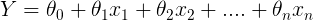
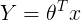
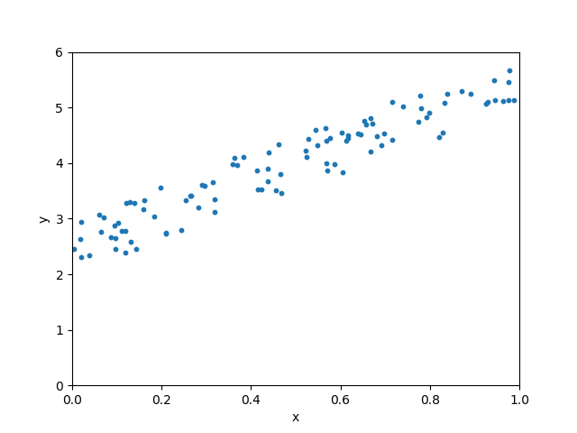

# ML
机器学习

**用python徒手写线性回归：**</br>
线性回归通常是每个数据科学家遇到的第一个机器学习算法。</br>
这是一个简单的模型，但每个人都需要掌握它，因为它为其他机器学习算法奠定了基础。</br>
**哪里可以使用线性回归?**</br>
这是一项非常强大的技术，可用于了解影响盈利能力的因素。</br>
通过分析前几个月的销售数据，它可用于预测未来几个月的销售额。</br>
它还可用于获取有关客户行为的各种见解。</br>
在博客结束时，我们将构建一个如下图所示的模型，即确定最适合数据的行。</br>
</br>
这是我要介绍的机器学习系列的第一篇博客。</br>
人们可能会被网络上关于机器学习算法的文章数量所淹没。</br>
我撰写此博客的目的有两个方面。</br>
它可以作为进入机器学习领域的人的指南，它可以作为我的参考。</br>

目录

     什么是线性回归
     线性回归假说
     训练线性回归模型
     评估模型
     scikit-learn实现


什么是线性回归

线性回归模型的目标是找到一个或多个特征（自变量）和连续目标变量（因变量）之间的关系。 当只有一个特征时，它被称为单变量线性回归，如果有多个特征，则称为多元线性回归。

线性回归假说

线性回归模型可以由以下等式表示

</br>
y=b0+b1*x1+b2*x2+ ...... +bn*xn</br>

Y是预测值

     θ0是偏差项。
     θ1，...，θₙ是模型参数
     x1，x2，...，xₙ是特征值。

上述假设也可以用</br>
</br>

其中

     θ是模型的参数向量，包括偏置项θ0
     x是x0 = 1的特征向量

数据集

让我们创建一些随机数据集来训练我们的模型。

```py
# imports
import numpy as np
import matplotlib.pyplot as plt

# generate random data-set
np.random.seed(0)
x = np.random.rand(100, 1)
y = 2 + 3 * x + np.random.rand(100, 1)

# plot
plt.scatter(x,y,s=10)
plt.xlabel('x')
plt.ylabel('y')
plt.show()
```

使用上面代码生成的数据集的图如下所示：</br>
</br>

训练线性回归模型

训练模型意味着找到参数，以便能用最合适的方式拟合数据。

我们如何确定最合适的生产线？
这条线为哪条线
预测值与观测值之间的误差最小称为最佳拟合线或回归线。 这些错误也称为残差。 可以通过从观察数据值到回归线的垂直线来可视化残差。

如果确定最合适的拟合线?</br>
这条线在哪?</br>
预测值与观测值之间的误差最小称为最佳拟合线或回归线。</br>
这些错误也称为残差。</br>
可以通过从观察数据值到回归线的垂直线来可视化残差。</br>
</br>


