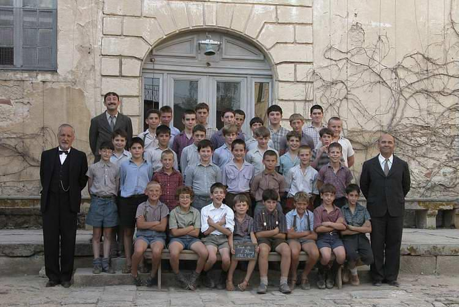
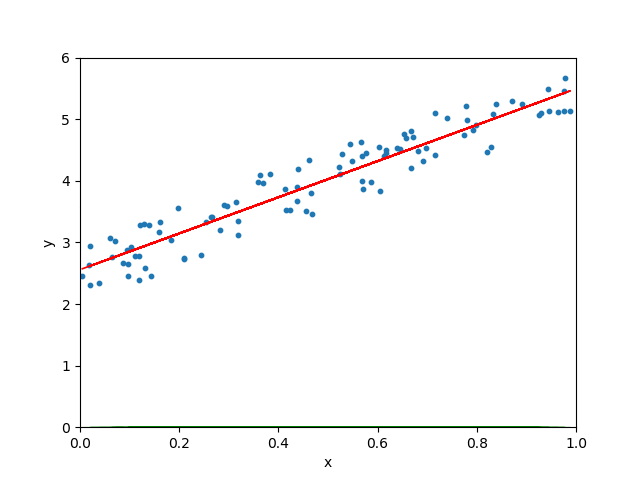

机器学习

AI上路与前行

 
**图片来自电影《放牛班的春天》**  

# 目录

<a href="Derivative.md">
    函数求导 
    得到曲线上每个点的变化率曲线,有了这个我们就可以在下节课下山了 
    
    
</a> 
<a href="GradientDescent.md">
    梯度下降 
    所有现实中的问题都可以用数学函数表示,问题抽象成连绵起伏的山,如何下山就是如何解决问题,梯度下降就是一种如何下山的算法 
    
    
</a> 
<a href="LinearRegression.md">
    线性回归 
    找到一个成本函数(损失函数),用梯度下降来减少成本(损失) 
    
</a> 
<a href="MathmaticOfGradientDesentForLR.md">
    梯度下降在回归中的数学推导 
     
    <!--  -->
</a> 

