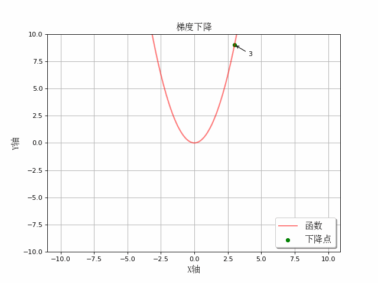

机器学习

AI上路与前行

 
**图片来自电影《放牛班的春天》**  

# 目录

<a href="Derivative.md">
    函数求导 
    
    
</a> 
<a href="GradientDescent.md">
    梯度下降 
    
    
</a> 
<a href="LinearRegression.md">
    线性回归 
    
</a> 

